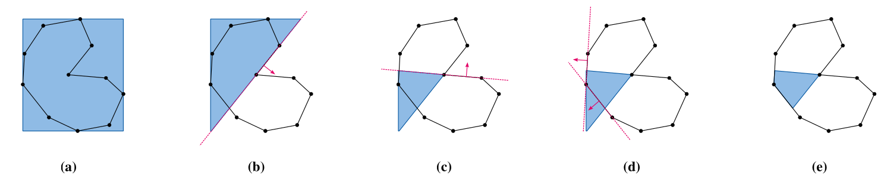

# Exact and Efficient Mesh-Kernel Generation

*Computer Graphics Project, Summer Semester 2026, Technische Universität Berlin*

*Joel Steinhardt*

*Based on the work of: [J. Nehring-Wirxel, P. Kern, P. Trettner, L. Kobbelt, "Exact and Efficient Mesh-Kernel Generation for Robust Geometric Computations", Computer Graphics Forum, 2025](https://www.graphics.rwth-aachen.de/publication/03355/)*

[Intro]


## 1. Running the Code

Assuming Ubuntu/Debian

```bash
sudo apt install build-essential
sudo apt install xorg-dev libglu1-mesa-dev freeglut3-dev mesa-common-dev # Polyscope dependencies
```

In the root directory, run:

```bash
cmake . -B build -DCMAKE_BUILD_TYPE=RelWithDbInfo # BUILD_TYPE can also be `Release` or `Debug`
cmake --build build --parallel
```

To run the application, then run:

```bash
./build/bin/project
```

In the application, you can select one of the available meshes from the drop-down menu in the top right corner. More meshes in OFF format can be added to the `off_files` folder. To generate the kernel, click either "Generate Kernel" or "Generate Kernel Parallel". To step through the generation algorithm, check "Update Visuals During Stepping" and click on "Start Kernel Stepping". Now you can step through the algorithm using "Next Step", or finish the generation immediately using "Finish Kernel". 


## 2. Definition

The kernel $\cal K$ of a mesh $M$ is the set of points $\bold p$ within $M$ from which every point on the surface of $M$ is visible. It can be defined as the intersection of negative half-spaces of all supporting planes $p_i$ of the mesh's faces.

$$\mathcal{K}(M) = \{\bold p \in \mathbb{R}^3 : \forall i : n^\top_i \bold p + d_i \leq 0\}$$

Here, $n_i$ are outward pointing normals and $d_i$ are the offsets of the supporting planes. This implicitely defines a supporting plane as $p_i = n^\top_i \bold p + d_i = 0$ for face $f_i$.

Use cases for computing the kernel include autonomous exploration or star-shaped decomposition of meshes.

## 3. Algorithm Implementation

### 3.1 Technology

C++, Polyscope, PMP, IPG, OpenMP

### 3.1 The Base Algorithm

The base algorithm for computing the kernel works in an iterative manner: It iterates over all supporting planes of $M$ and performs polygon-plane cuts on an intermediate kernel $\hat{\cal K}$ until either all planes have been processed or $\hat{\cal K}$ becomes empty. $\hat{\cal K}$ is initialized as the axis-aligned bounding box (AABB) of $M$. 

The image below illustrates the algorithm in 2D. The blue polygon represents the intermediate kernel $\hat{\cal K}$ and the red lines represent the supporting lines of the mesh. The arrows indicate the normals and lie in the positive half-space of the supporting lines.



#### 3.1.1 Exact Integer Arithmetic Foundation

pass

#### 3.1.2 Polygon Plane Cutting

The polygon-plane cutting operation is the most important operation of the algorithm. Given a mesh $M$ and a plane $\bold p$, it is the goal of this algorithm, to cut $M$ at $\bold p$, discard all of $M$ that lies in the positive half-space and fill the remaining hole with a new cap face. This operation is based on the work of Nehring-Wirxel et al. and was implemented with the exact integer arithmetic framework of IPG. 

The algorithm aims to find all edges of $M$ that intersect with $\bold p$. For this, we start at an arbitrary vertex and continuously and greedily find the next vertex that brings us closer to $\bold p$. During this, we check whether this descent step crosses $\bold p$. If that is the case, we leave the descent phase and return this half-edge.

Edge Descent may fail and may get stuck in a local minimum. If this happens, we perform a multi-start edge descent by starting from the six extremes of the AABB of $M$. If all six attempts fail, we fall back to a linear search to find a crossing edge, but from empirical testing, it is very unlikely but not impossible for multi-start edge descent to fail while actually there is a valid crossing edge that the linear search would find. If the linear search also fails, we it is concluded that $\bold p$ misses $M$ entirely (despite intersecting with the AABB of $M$, see Section 3.2.1) and the cut is skipped.


### 3.2 Non-parallel Optimizations

The main operation of this algorithm is the polygon-plane cut, which can be expensive. There are several optimizations that Nehring-Wirxel et al. propose to accelerate the algorithm that were implemented in this project.

#### 3.2.1 Bounding Box Checks

With larger meshes, it is likely that a cut, specifically a cut at a convex face, misses $\hat{\cal K}$ entirely and will not have any effect. To avoid performing expensive polygon-plane intersection tests, we maintain an AABB of $\hat{\cal K}$ by storing its minimum and the maximum vertex, `aabb_min` and `aabb_max`.

Now, before performing a cut, we classify this AABB against the cutting plane.

- If the cutting plane intersects the AABB, we perform the cut as we would have done before.
- If the cutting plane lies fully in the negative half-space, we can skip the cut as nothing would be removed from $\hat{\cal K}$.
- If the cutting plane lies fully in the positive half-space, we can terminate and return an empty kernel as this cut would remove all points from $\hat{\cal K}$.

When a cut is performed on $\hat{\cal K}$, we update the AABB accordingly by finding the new minimum and maximum vertex. This avoids recomputing the AABB from scratch after every cut.

#### 3.2.2 Convex/Concave Classification

Before performing cuts, we can classify the faces of the mesh as either convex or concave by computing the signed volume between two adjacent faces $f_0$ and $f_1$. For this, we iterate over all edges $e_i$ in $M$ and find the two incident faces $f_0$ and $f_1$ to $e$. We find a vertex $v$ that does not share the edge $e$ and classify it against the plane of $f_0$ using the `classify()` function of the IPG framework. If this classification returns a positive value, $v$ sits above the plane of $f_0$ and both $f_0$ and $f_1$ are concave. In result, we store a boolean vector indicating the convexity of each face.

Using this information, we can perform some further optimizations.

If all faces are convex, we can skip the kernel computation entirely and return the mesh itself as for a fully convex mesh, the kernel is equal to the mesh. We also use the Euler-Poincaré formula to check if the mesh has a genus of greater than zero: $\chi(M) = v-e+f = 2(1-g)$ with $v$ being the number of vertices, $e$ the number of edges $f$ the number of faces, and $g$ the genus of the mesh. We check $\chi(M) < 2$. If this holds true, it implies $g > 0$ and the mesh kernel is guaranteed to be empty. Then, we can return early.

We also sort the supporting planes based on the convexity of their corresponding faces. We want to prioritize concave cuts as they are more likely to reduce the kernel volume early on. Also, this will shrink the AABB of $\hat{\cal K}$ early on, making cut skips due to missing the AABB more likely and reducing the overall amount of cuts that need to be performed.

#### 3.2.3 Coplanar Grouping

If two faces are coplanar, their supporting planes are identical and performing cuts with both planes would be redundant. Thus, we group coplanar faces together and only perform one cut. We iterate over all non-boundary edges, find their incident faces, and check if their supporting planes are parallel and if their plane coefficients match. If both conditions hold, the two faces are considered coplanar and we merge them using a `unite()` operation in a Union-Find data structure. Later code then pushes only one representative of each coplanar group to the list of supporting planes. Note that this technique will not find disconnected coplanar regions.

### 3.3 Parallelization

To further optimize the algorithm, we can parallelize the cut operations as these constitute the most computationally expensive phase of the algorithm. The core concept is to partition the supporting planes into independent batches and perform the cuts within each batch concurrently. This results in one local intermediate kernel per batch. However, rather than computing a geometric boolean intersection of these local kernels – which would be computationally heavy – the parallel phase is utilized as a filtering step. The final kernel is then generated by harvesting only the planes that survive this local culling and apply them in a final sequential pass.

For this project, three grouping strategies were implemented and tested. Each strategy creates eight batches:

- **Spatial Octants:** For each face, we compute the centroid and determine the correct octant relative to the center of the mesh's AABB. Each octant is a batch.
- **Similar Normals:** For each face, we consider its normal. All faces for which the normal points to the same directional octant are grouped together.
- **Dissimilar Normals:** For each face, we consider its normal. Planes of similar normal direction (see previous strategy) are distributed to the eight batches in a round-robin fashion.

The parallelization is implemented using OpenMP. Each batch is processed in parallel, with each thread starting with the full AABB of $M$ and trimming it using only its assigned subset of planes. If the local intermediate kernel of a thread becomes empty, the thread flags the global kernel as empty. After all batches have been processed, the algorithm iterates over the faces of the non-empty local intermediate kernels to extract their exact planes. Any plane that was cut away during concurrent processing is permanently discarded. These surviving planes are merged into a master list and applied to a new bounding box in a final sequential pass to obtain the final kernel.

## 4. Results

# Notes

- We iterate over all faces and classify them as either convex or concave.

- Supporting planes are sorted based on the convexity of their corresponding faces. Concave faces are prioritized as they are more likely to reduce the kernel volume early on.

- We maintain a bounding box for $\hat{\cal K}$ and update it after each cut.

- We iterate over the list of supporting planes and perform cuts on $\hat{\cal K}$ using the planes. For this, we check if the plane intersects the bounding box of $\hat{\cal K}$. If it does, we perform a cut and update the bounding box.

- If the bounding box of $\hat{\cal K}$ lies fully in the negative half-space of the plane, we can skip the cut as it does not cut anything away from our intermediate kernel.
- If the bounding box of $\hat{\cal K}$ lies fully in the positive half-space of the plane, we can terminate early and return an empty kernel as this cut would remove all points from our intermediate kernel.